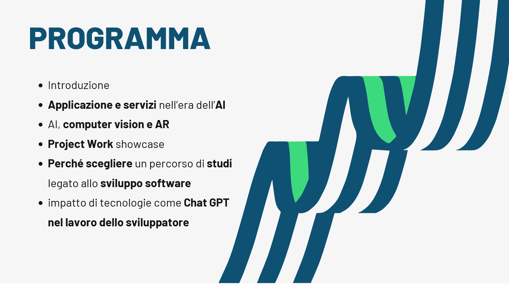

# Interactive Hologram and Face Tracking Project


This project is a real-time application that integrates hand tracking, face extraction, and hologram effects using Python and computer vision libraries. It captures video input from a webcam, identifies hand and face landmarks, and overlays holographic images based on hand positions, as well as dynamically adjusts face overlays.

## Getting Started



### Prerequisites

You need Python installed on your machine, as well as the following libraries:
- OpenCV (cv2)
- MediaPipe
- NumPy

You can install these dependencies via pip:

```bash
pip install opencv-python mediapipe numpy
```
On newer Apple Silicon Chip you must install dedicated libraries instead as follows
```bash
pip install opencv-python mediapipe-silicon numpy
```
## Usage
To run the application, execute the Python script from your terminal:
```bash
python main.py
```
The script will access your webcam. Press 'q' to quit the application and close all windows.

## Libraries and Acknowledgments
- **OpenCV (cv2)**: Used for image processing and rendering video frames.
- **MediaPipe**: Utilized for robust hand and face detection and tracking.
- **NumPy**: Employed for numerical operations on image arrays.
## Features
**Hand Tracking**: Detects and tracks the hand position in real time.
**Face Mesh**: Creates a mesh over detected faces to extract facial landmarks.
**Hologram Effect**: Overlays a holographic video on a designated area based on hand coordinates.
**Dynamic Face Overlay**: Adjusts the transparency and position of extracted faces to blend with background.
## Key Imports

- `cv2`: OpenCV library used for the majority of the image processing tasks.
- `ai_engine.object_detector`: A module for object detection, specifically designed for detecting predefined objects such as faces and hands.
- `processing.functions`: Contains utility functions for image manipulation, such as cropping images and inserting images at specified coordinates.

## Key Variables

### Model Targets

- `OBJECTS`: A tuple containing the types of objects the models will detect. Currently set to detect "face" and "hand".
- `face_detector`: An instance of `ObjectDetector` for detecting faces.
- `hand_detector`: An instance of `ObjectDetector` for detecting hands.

### Dimensionality Parameters

- `HOLO_BOX_SIZE`: Defines the size of the hologram box as (400, 200).
- `HEAD_BOX_SIZE`: Defines the size of the head box as (250, 300).
- `FACE_BOX_SIZE`: Dynamically calculated based on `HEAD_BOX_SIZE` to be 60% of the width and 58% of the height of the head box.

### Effects and Resources

- `HOLOGRAM_EFFECT_PATH`: Path to the hologram effect video file.
- `FACE_BASELINE_PATH`: Path to the baseline image for the face.

### Source Streams

- `hand_source`: Stream source index for hand detection, set to `0` for the default webcam.
- `face_source`: Stream source index for face detection, set to `1` for a secondary camera or another connected video source.

## Functions

This section provides detailed explanations of each function within the script, outlining their purpose, inputs, and the processes they perform.

## `run_hands_pipeline(model, src)`

This function is designed to process hand detection from a video source.

- **Parameters:**
  - `model`: An instance of `ObjectDetector` designed to detect hands.
  - `src`: The video frame source where hand detection is performed.
- **Process:**
  1. Extracts wrist coordinates from the detected hand key points.
  2. Calculates coordinates for three different boxes based on the wrist's position:
     - A hologram box using `HOLO_BOX_SIZE`.
     - A head box using `HEAD_BOX_SIZE` with an additional y-axis offset.
     - A face box using `FACE_BOX_SIZE` with a slight y-axis offset.
- **Returns:** A tuple containing coordinates for the hologram, head, and face boxes. If no wrist is detected, the function completes without returning any coordinates.

## `run_face_pipeline(model, src)`

Processes face detection and performs operations on the detected face area.

- **Parameters:**
  - `model`: An instance of `ObjectDetector` for detecting faces.
  - `src`: The video frame source from which the face is detected.
- **Process:**
  1. Extracts the bounding box of the detected face.
  2. Crops the detected face area from the frame.
  3. Extracts key facial points from the cropped face area.
  4. Crops the face further based on detected key points.
- **Returns:** The final cropped face area after processing the detected key points.

## `run_main(face_model, hands_model)`

The main function initializes video capture for both face and hand detection and applies effects based on detections.

- **Parameters:**
  - `face_model`: An instance of `ObjectDetector` for face detection.
  - `hands_model`: An instance of `ObjectDetector` for hand detection.
- **Process:**
  1. Sets up video capture for both hand and face sources.
  2. Continuously reads frames from both sources.
  3. Applies the face and hands pipelines to the captured frames.
  4. Inserts the processed face, a baseline head image, and a hologram effect into the frame.
  5. Displays the resulting frame.
  6. Exits the loop and releases all resources when the "q" key is pressed.
- **Execution Control:** Uses OpenCV's GUI functions to handle real-time video processing and display.


## License
This project is licensed under the MIT License - see the LICENSE file for details.

## Contributions
Contributions are welcome. Please fork the project and submit a pull request with your features.

## Final Notes
This application uses your webcam for live input. Ensure that your webcam is configured correctly and accessible by Python through OpenCV.
Warning: may have to enable camera permission on macOS

